Over the past year, Spyder along with most of the open science community has faced major funding challenges, thanks to a combination of the current geopolitical environment curtailing grant funding, tightening of corporate sponsorship budgets, and a massive redirection of spending toward AI services to the exclusion of all other priorities, including the very open source libraries and tools they rely on.
However, due to an also-unprecedented level of [community contributions to the project](/donate), we've been able to weather the storm so far and keep the project afloat and moving forward.

Your support directly funds three part-time team members (Daniel as a core developer, Juan Sebastian as a junior developer and Andres as a UI/UX designer), and has allowed us to keep fixing bugs, adding new features and improving the interface and releasing new versions.
And thanks to your contributions also supporting Daniel's work as Spyder's release manager, you've funded the release in 2025 of Spyder 6.0.8, 6.1.0 (including a total of 8 alphas, betas and release candidates), and two bugfix versions of 6.1.x (6.1.1 and 6.1.2).

We want to take the time to share our appreciation by highlighting everything that your support has directly made possible, as well as sharing what we'll be able to work on this year with your continued funding.
Let's get started!

## New Features

While their first priority is stability and core maintenance, our community-funded team members have been able to deliver a variety of key features and improvements you've requested.
These include major new capabilities for remote development and computing, expanded real-time code analysis with Ruff, and a number of usability and workflow enhancements throughout the application.

### Remote development

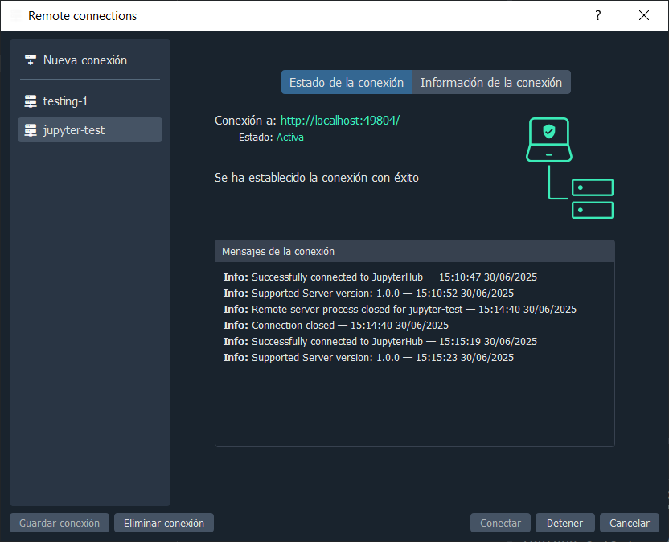

Thanks to you, Daniel was [able to implement](https://github.com/spyder-ide/spyder/pull/24645) graphical support for [connecting to JupyterHub servers](https://github.com/spyder-ide/spyder/issues/24623) in Spyder 6.1.0, making it easy run your code on your institution's machines and HPC clusters without leaving the comfort of Spyder or being limited to notebooks.
This adds a new tab to the Remote Connection dialog for entering your JupyterHub credentials, which are stored securely by your operating system so that Spyder can open open new consoles in remote JupyterHub environments with just a click!

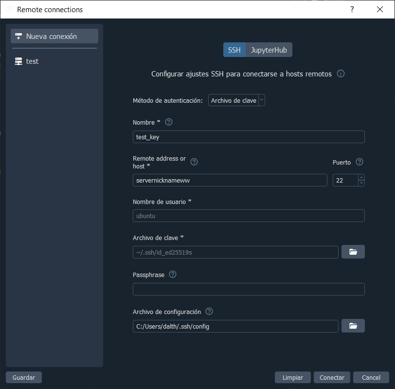

Meanwhile, for those using SSH, Daniel also [added support](https://github.com/spyder-ide/spyder/pull/24343) in Spyder 6.1.4 for reading settings from [standard SSH configuration files](https://github.com/spyder-ide/spyder/issues/22464) for remote connections, which both makes it simpler to connect to your already-configured SSH servers, and allows supporting more complex setups requiring more extensive configuration.
There's now a new "Configuration File" field in the SSH tab of the Remote Connection dialog, letting you set the path to a file of your choice, which will be used for any settings not configured explicitly in Spyder's dialog, as well as any other more advanced options.

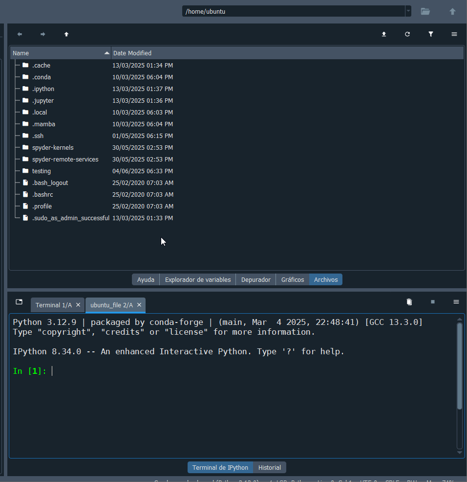

When connected to a remote machine, Daniel [implemented support for a variety of context menu actions](https://github.com/spyder-ide/spyder/pull/24494), allowing you to create, manage and delete remote files and folders just as easy as local ones.
This allows to more easily create, rename, copy/paste, upload/download and delete individual files or even whole directories, as well as copy their absolute paths and several other actions.
Simply open the Files pane in Spyder 6.1.0+ and right click the files or directories you want to work with to see the new options.

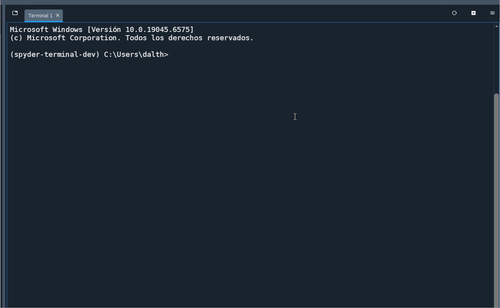

Finally, [Daniel worked extensively on](https://github.com/spyder-ide/spyder-terminal/milestone/22?closed=1) our first-party [Spyder-Terminal plugin](https://github.com/spyder-ide/spyder-terminal), included by default with our [standalone installers](/download), including [updating it](https://github.com/spyder-ide/spyder-terminal/pull/355) to [fully support Spyder 6](https://github.com/spyder-ide/spyder-terminal/issues/345), [adding remote terminal support](https://github.com/spyder-ide/spyder-terminal/pull/358), and [releasing](https://github.com/spyder-ide/spyder-terminal/issues/360) a new feature version, [Spyder-Terminal 1.3.0](https://github.com/spyder-ide/spyder-terminal/releases/tag/v1.3.0), among other work.
This makes it easy to work with operating system terminals right inside of Spyder, not only on your local machine but also any remote host you're connected to.

### Ruff support

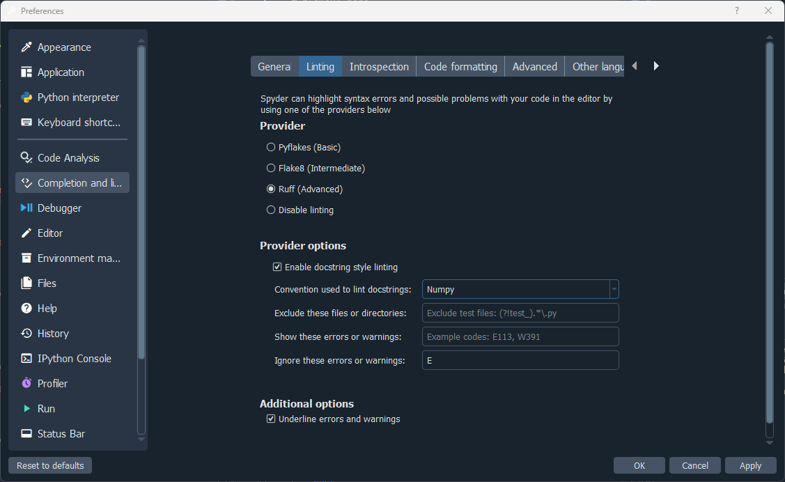

[Ruff](https://docs.astral.sh/ruff/) has become the linter and formatter of choice for many Python software engineers due to it its extreme speed (10-100x faster than existing tools, being written in Rust), support for a comprehensive set of checks and formatting out of the box, and excellent stability.
Thanks to [Daniel's work](https://github.com/spyder-ide/spyder/pull/24908) funded by the community, [Ruff support is now built in to Spyder](https://github.com/spyder-ide/spyder/issues/21040).
This makes Spyder's real-time code analysis and code formatting faster and more reliable, adds far more useful error checks, and makes configuration easier.

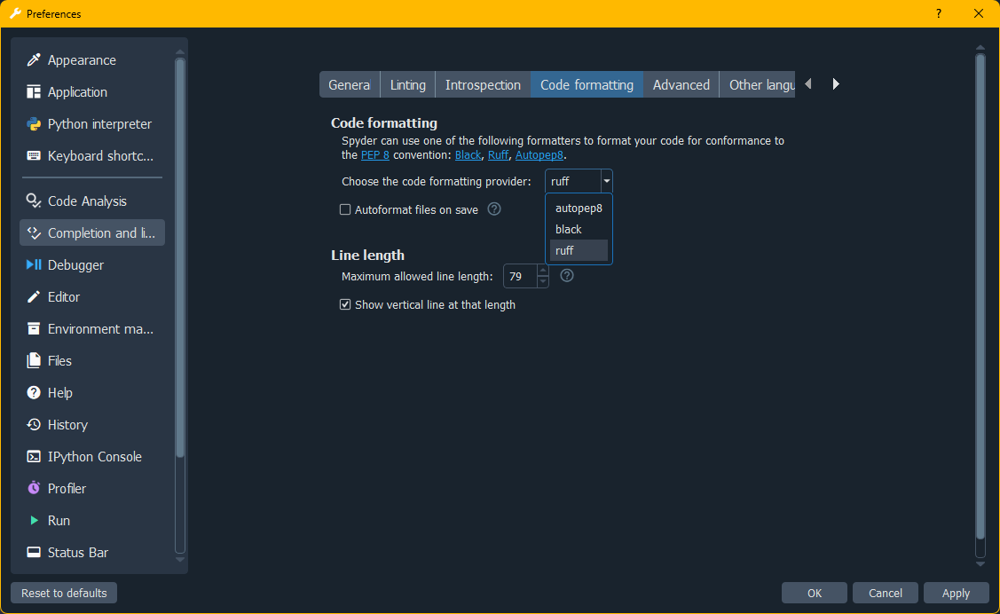

You can switch to Ruff for real-time linting in Spyder 6.1.0+ by selecting it from the Provider list under the Linting tab of the Completion and Linting section of Spyder's Preferences, and configure what errors and warnings you want to show under the Provider Options section.
With it enabled, the messages in the Editor's left sidebar as well as underlining issues in your code will now be powered by Ruff!
Likewise, you can switch to Ruff for code formatting (from Source > Format code with...) under the Code Formatting tab.

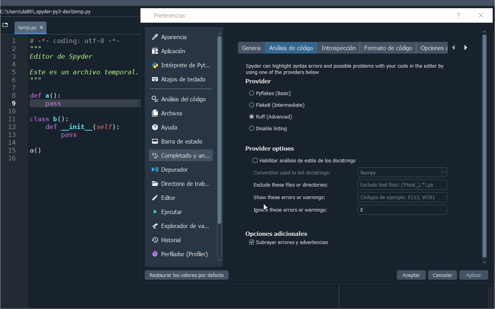

Additionally, Daniel also added [support for docstring linting using Ruff](https://github.com/spyder-ide/spyder/pull/24943), replacing the unmaintained Pydocstyle.
When Ruff linting is enabled in Spyder 6.1.0+ and the "Enable docstring style linting" is checked, Ruff will optionally now lint your docstrings for style and formatting as well as your code!

### Key enhancements

Meanwhile, your donations also funded Juan Sebastian's work on a variety of impactful enhancements in Spyder 6.1.0 to 6.1.2, driven by community feedback.

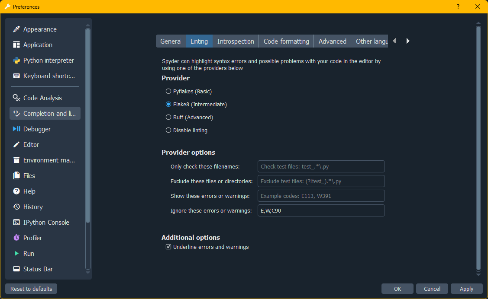

This included built-in support for [using Flake8 for linting](https://github.com/spyder-ide/spyder/pull/24532) and [configuring its settings] https://github.com/spyder-ide/spyder/pull/24610, making Spyder's real-time code analysis more powerful for users who want something simpler than the depth and breadth of checks offered by Ruff.
Flake8 can be selected from the same Completion and Linting -> Linting preferences pane in Spyder 6.1.0+.
For those using Ruff instead, Juan Sebastian also added the option to [lint Google-format docstrings with it](https://github.com/spyder-ide/spyder/issues/25045), allowing Ruff's docstring linting to support multiple docstring formats.

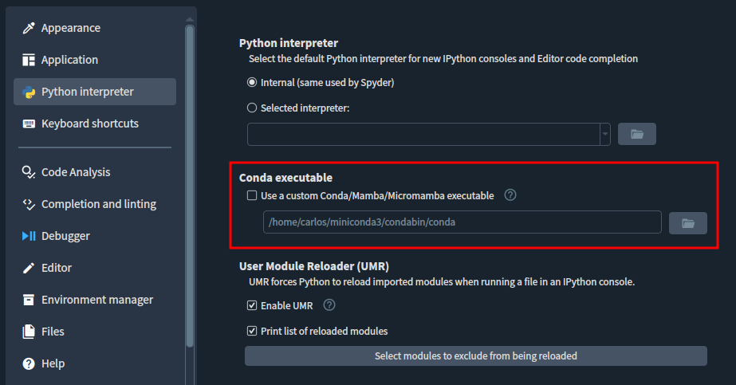

Several of his other improvements improved integration between Spyder and the operating system/other applications. In particular, he [added support in 6.1.0 to the Files and Projects panes](https://github.com/spyder-ide/spyder/pull/24382) for [moving files to the operating system trash](https://github.com/spyder-ide/spyder/issues/21659) can when deleting them, which allows you to easily recover a deleted file.
He [also added](https://github.com/spyder-ide/spyder/pull/24990) the option to [set a custom Conda executable](https://github.com/spyder-ide/spyder/issues/20357), allowing the  for Spyder to use, allowing Spyder's IPython Console to work for custom Conda installations.

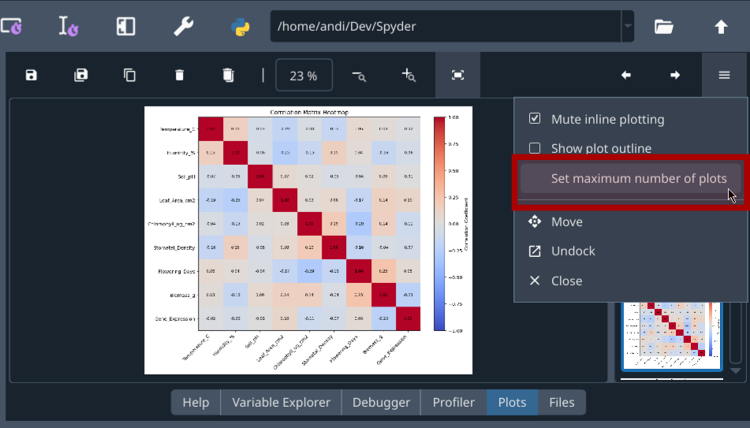

Juan also made several improvements to Spyder's Plots pane.
This included a [new option](https://github.com/spyder-ide/spyder/pull/25320) in 6.1.2 to set the maximum number of recent figures shown in the plots pane, which can substantially improve performance](https://github.com/spyder-ide/spyder/issues/25249) when generating many plots.
He also [improved](https://github.com/spyder-ide/spyder/pull/24585) plot display and scaling on high-DPI screens in 6.1.0, ensuring [plots look sharp](https://github.com/spyder-ide/spyder/issues/22039) regardless of the current monitor size.

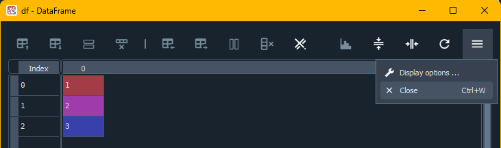

Finally, he focused on improving usability through the application for Spyder 6.1.0.
This included [adding](https://github.com/spyder-ide/spyder/pull/24485) a new button and keyboard shortcut to the Variable Explorer to [close all open variable viewer dialogs](https://github.com/spyder-ide/spyder/issues/21814), making it simple to do so with one click; and [enabling](https://github.com/spyder-ide/spyder/pull/24424) keyboard shortcuts to [switch to different Spyder panes](https://github.com/spyder-ide/spyder/issues/1351) even when they are undocked, making it much more natural to work with undocked panes and fixing an longstanding feature request.
Finally, [he added](https://github.com/spyder-ide/spyder/pull/24801) the ability to zoom in and in the IPython Console pane by [holding `Ctrl` and the mouse wheel](https://github.com/spyder-ide/spyder/issues/20123), the same way it works in Spyder's Editor.

## Design and UI/UX

Andres was hard at work this past year adding full theme support to Spyder, improving its interface and user experience, creating and improving icons for Spyder features, and assisting with other graphical tasks.

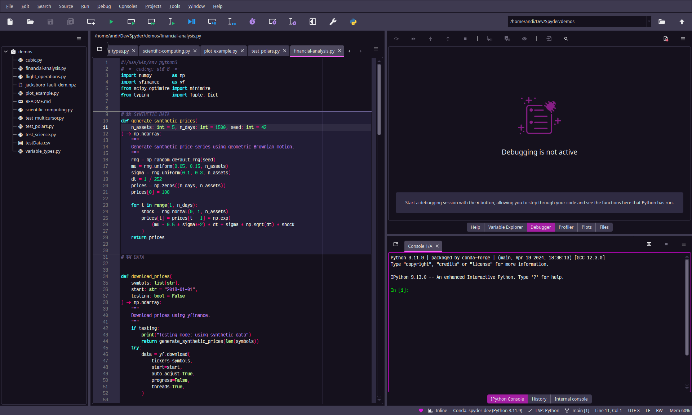

Perhaps most excitingly, Andres worked on a comprehensive overhaul of Spyder's interface and code highlighting theme system, to make Spyder's look and feel much more customization and match your favorite syntax highlighting styles in the Editor.
This has already borne fruit, with improvements throughout to the colors, consistency, contrast and accessibility of Spyder's existing themes.
However, he also begun work during 2025 on the next, more ambitious step, including a brand new graphical application--ThemeWeaver--to make it easy to create and modify themes for Spyder, which is in the process of being released for users now in 2026, with more improvements planned.
He also created a new series of unified interface/syntax themes for Spyder, including Dracula, Grubvox, Miami Nights, and many other options popular in other editors/IDEs, which will debut along with full custom theme support in the forthcoming Spyder 6.2 release.

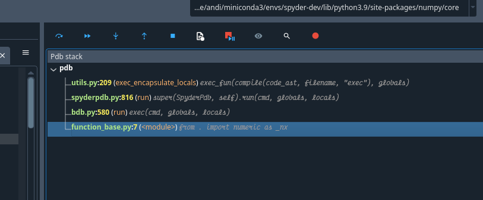

Andres worked on a number of interface improvements through Spyder, particularly adding and improving new and more user-friendly icons.
This included new toolbar icons for the Debugger pane, Profiler and elsewhere, with a consistent look, colors and symbology across icons to make it easier for users to find and grasp the purpose of each one.
Andres also designed the new graphics and messaging around Spyder updates, making it easier for users to see what's improved in the new version as well as contribute to help support Spyder's development.

<iframe width="560" height="315" src="https://www.youtube.com/embed/lBnfVmSQLi8?si=rwIP0lZ6-v04nZjh" title="YouTube video player" frameborder="0" allow="accelerometer; autoplay; clipboard-write; encrypted-media; gyroscope; picture-in-picture; web-share" referrerpolicy="strict-origin-when-cross-origin" allowfullscreen></iframe>

Finally, Andres created a number of videos and graphics to help communicate the new features and enhancements to users, including a number of images for social media.
Most prominently, he produced a special highlight video demonstrating all the key new features in Spyder 6.1, released this past year, and showing users how to take advantage of them.
He's also been helping update our documentation and other resources with updated screenshots for the latest versions of Spyder.

## Core maintenance

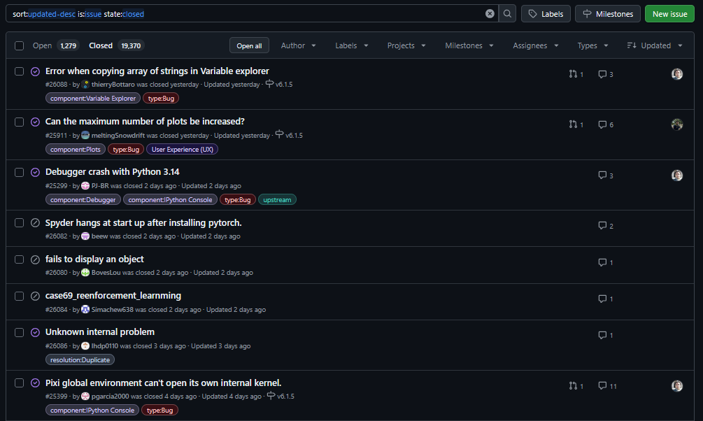

In addition to the aforementioned marquee features and enhancements, the community-funded team worked on countless smaller issues, bug fixes and maintenance tasks essential to Spyder's health as a project.
For example, Daniel added support for IPython 9 in [Spyder](https://github.com/spyder-ide/spyder/pull/24877), [Spyder-Kernels](https://github.com/spyder-ide/spyder-kernels/pull/559) and [QtConsole](https://github.com/spyder-ide/qtconsole/pull/640), ensure Spyder and its IPython Console support the latest and greatest version.
He also [added the ability to Spyder's theme](https://github.com/ColinDuquesnoy/QDarkStyleSheet/pull/363), QDarkStyle, to create custom color pallets, essential prep work that the Andres' theme improvements later built upon.

Meanwhile, Juan Sebastian [completed](https://github.com/spyder-ide/spyder/pull/24812) the extensive refactoring and cleanup to fully [transition to a clean, modern Python 3 codebase](https://github.com/spyder-ide/spyder/issues/11615) and removing the last vestiges of older compatibility code, making the code easier to read and maintain going forward.
He also helped fix countless smaller bugs, far too many to describe here.

## Looking ahead

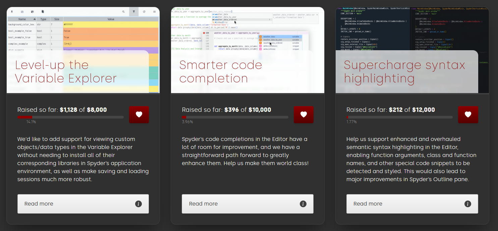

Finally, we wanted to share a preview of the projects your continued community donations will directly fund and make possible, in addition to continued Spyder releases and core maintenance.

We will be able to hire our backend developer Hendrik, who was previously funded under a completed grant, to continue his work improving Spyder's remote editing features.
In particular, he'll add full support for code completion and linting in remote environments, including taking advantage of remote packages.
Hendrik will also add support for the [Pyrefly](https://pyrefly.org/) code analysis architecture, which is much faster and smarter than Spyder's existing linting and completions, and works much better with optional static typing.

Meanwhile, we will continue to hire Daniel in his role as Spyder's release manager, releasing the various alpha, beta and release candidate builds for Spyder 6.2.0, the stable release, and patch versions on top of that.
He'll also be able to work on adding support for remote Spyder projects, making it easier to pick up where you left off on remote machines.

Finally, we plan to use incoming donations to continue to fund Andres' work, particularly further user-requested themes and improvements to the to-be-released Theme Weaver application.
As funding allows, he'll also be able to work on a web service to make it even easier for you to create and share your own interface and syntax themes for Spyder, without having to download and install anything.

If community funding continues to grow, there is so much more we'd love to be able to deliver for everyone!
This includes support for more user-requested data types in the Variable Explorer, much more powerful TreeSitter-based semantic highlighting in the Editor, smarter code completion improvements, finish the Spyder-Env-Manager plugin for creating, installing and updating packages and environments in Spyder, the new Viewer pane for viewing interactive Bokeh-styled figures, and more!
If you're interested in seeing any of these happen, please [donate today](/donate)!

Once again, we appreciate the support of the entire community in making the Spyder project possible, and want to say a big THANK YOU to everyone who contributes!
We look forward to what we will be able to do with your continued support this year, and as always--happy Spydering!🕸️
