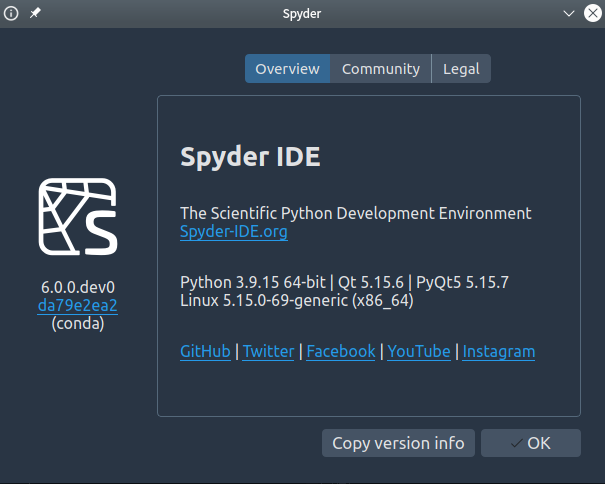

I started out using Spyder just like many of you, employing it for my research in modeling and simulation all the way back in late 2009, shortly after it was first publicly released.
Back then, Spyder didn't have rendered, rich-text help in the Help pane, just plain text that was harder to read and parse.
In 2010 I decided to develop this feature myself, which became my first substantial contribution to Spyder.
After many more contributions over time, I became the lead maintainer in 2013 when Spyder's original author [Pierre Raybaut](https://pierreraybaut.github.io/) moved on.

In 2023, Spyder received a [Chan Zuckerberg Initiative](https://chanzuckerberg.com/) Essential Open Source Software for Science [Cycle 5 grant, number 384](https://chanzuckerberg.com/eoss/proposals/enhancing-spyder-ide-remote-support-for-scientific-research-in-python/) to support a new remote development architecture for Spyder as well as related development and maintenance.
With this grant, we've been able to develop Spyder 6 with remote development support, as well as fund a whole team of developers to work on the project—including myself, with Spyder becoming my full-time job.

Let's go through what I've worked on for Spyder 6!

## Implementing the remote development frontend

I was in charge implementing the frontend (graphical interface) of the new remote development architecture, with [Hendrik](https://github.com/hlouzada) responsible for [the backend](../spyder-6-remote-development).
First, I [I created](https://github.com/spyder-ide/spyder/pull/21734) a generic base class for complex dialogs that need a sidebar, making the existing Preferences window layout modular and reusable by other plugins.
Similarly, [I made](https://github.com/spyder-ide/spyder/pull/21857) the individual preference pane widget modular and generic, as well as added a number of UI improvements to benefit everything that uses it.

With that preliminary work out of the way, [I implemented](https://github.com/spyder-ide/spyder/pull/22079) the remote connection manager dialog to create and manage connections to remote servers, offering different SSH authentication methods with user credentials saved securely.
This information is used to automatically open a connection, install the server [Hendrik developed](../spyder-6-remote-development), start a Spyder Kernel in the remote machine and create an IPython console connected to it.
In Spyder 5, you needed to do all that by hand, which was quite a [long and cumbersome process](https://docs.spyder-ide.org/5/panes/ipythonconsole.html#connect-to-a-remote-kernel).
With the improvements in Spyder 6, all you need to do is enter your basic SSH credentials the first time you can connect, and Spyder takes care of everything else with one click!

Finally, [I added](https://github.com/spyder-ide/spyder/pull/22328) detailed logging messages for remote connections in the status dialog.
This helps you more easily track the connection progress, as well as exactly what is happening behind the scenes to aid in debugging any problems that may arise.

## Improving UI/UX

Aside from working on the remote connection manager itself, I spent most of my remaining energies during the Spyder 6 cycle working on many smaller UI/UX fixes and enhancements throughout the application.
For these, I followed the best practice design patterns followed by modern web applications, so users have an easier time when switching between different environments.
The end result was a much more coherent and intuitive UI, as well as a more attractive one.

The biggest single change was a [complete overhaul](https://github.com/spyder-ide/spyder/pull/21101) of the plugin manager preferences pane, to make it much more useful and user-friendly as well as add support for listing external along with internal plugins.
Previously, it only showed a simplistic set of checkboxes next to each internal plugin's name with no other styling or information, and with no place to list external plugins (which the you're much more likely to want to enable/disable vs. internal ones).
After an extensive reworking, it is now a much more informative and appealing scrollable list, showing each plugin's icon, short description, internal/external status and enable/disable checkbox.
Furthermore, external plugins are now included in the list, shown at the top for easy access, with plugins within each group sorted alphabetically by (localized) name to aid navigation.

Another significant improvement was [adding support](https://github.com/spyder-ide/spyder/pull/20933) for configuring the Spyder's interface font.
This was requested by many Spyder Chinese users on Windows, where the default font for Latin text was ugly and difficult to read will benefit other users who prefer a different UI font than the current default.
The work also included many other enhancements and fixes throughout the Spyder interface to support this change and fix other issues.

The Spyder Preferences dialog as a whole got [many overall UI improvements](https://github.com/spyder-ide/spyder/pull/21233), most prominent being a much more organized listing the preferences panes by group/importance and then alphabetically within them.
The sidebar also received a major layout and styling overhaul, making it much less cramped and much more refined.
The pane area was cleaned up, removing redundant lines and elements and making the spacing more comfortable and consistent.
Finally, numerous bugs, issues and minor tweaks were addressed throughout.

The Plots pane also saw [plenty of love](https://github.com/spyder-ide/spyder/pull/22029), with a much more intuitive zooming and sizing experience.
Plots are still fit to the pane by default, but zoom in/out buttons are now enabled by default, and a new toolbar button allows toggling between fit to window and 1:1 actual size.
On top of that, zoom level is now saved per plot, and double-clicking a plot shows it full size.
Additionally, the toolbar is more organized and users can drag and drop their plots in the list to re-order them as they wish.
Put together, this solves a significant set of past pain points that Spyder users and developers have previously expressed.

I made numerous other UI/UX enhancements across Spyder, far too many to list here.
Here's a sampling of some more:

* [Rendering tweaks to menus](https://github.com/spyder-ide/spyder/pull/21511) to menus
* [Styling improvements to pane tab bars](https://github.com/spyder-ide/spyder/pull/21133)
* [Sizing fixes to elements & new close buttons](https://github.com/spyder-ide/spyder/pull/21276)
* [New improved comboboxes](https://github.com/spyder-ide/spyder/pull/21555)
* [UI refinements to the Find pane](https://github.com/spyder-ide/spyder/pull/21622)
* [Enhancements to hovers, hints & calltips](https://github.com/spyder-ide/spyder/pull/21710)
* [Display & layout upgrades to Files/Project](https://github.com/spyder-ide/spyder/pull/21813)
* [Remove redundant icons on OK, Cancel, etc](https://github.com/spyder-ide/spyder/pull/21945)
* [Solutions to many other UI issues](https://github.com/spyder-ide/spyder/pull/21707)

## Supporting the work of others

Beyond my own projects, a large part of my role as a maintainer and leader is supporting the work of others.

I've assisted [Juan-Sebsatian Bautista](https://github.com/jsbautista), one of our junior developers, in several significant enhancements to Spyder's UI.
In particular, [we've made UI/UX improvements](https://github.com/spyder-ide/spyder/pull/21134) to layout and scaling of the empty pane display and added a clear message if the emptiness is due to the IPython Console.
As part of that work, we also enhanced the About dialog layout as well.

Additionally, I helped Juan-Sebsatian with [several significant improvements](https://github.com/spyder-ide/spyder/pull/22200) to the console environments menu and statusbar widget.
These include showing user-added environments in the console envs menus for easy access, and breaking the consoles menu into sections by environment type for easier navigation.
It also consolidates environment tracking functionality previously duplicated between the IPython Console and the Python Interpreter preference pane.

I aided [Angela Remolina](https://github.com/AngelaRemolina)'s work on improving and adding real-time file search to the Switcher (`Ctrl-P`), making [a number of improvements](https://github.com/spyder-ide/spyder/pull/21275( to its performance and UI/UX.
These changes make the switcher compute file results asynchronously in a separate process to avoid interface freezes and improve performance.
Additionally, it highlights the matching characters in the results, filters the results to only include non-binary, text files that can reasonably be human-edited, clarifies the section layout and improves the tests.

Furthermore, I supported [Quentin Peter](https://github.com/impact27)'s work on the new Debugger pane with [more UI/UX improvements](https://github.com/spyder-ide/spyder/pull/22163).
We added a new postmortem debugging toolbar button, new icons for the `Go to Editor`, `Interrupt and Debug`, and `List Breakpoints` buttons, and section dividers to make the toolbar easier to navigate.
Additionally, we made the breakpoints table collapsible and fixed a theme incompatibility issue in the frames browser.

Finally, I built upon [Edgar Margffoy](https://github.com/andfoy) and [Stephannie Jimenez](https://github.com/steff456)’s new modular architecture for running files in Spyder 6, greatly [improving its UI and UX](https://github.com/spyder-ide/spyder/pull/22141).
These changes added customizable default run presets for specific file types, making it easier to customize run behavior.
In addition, the layout of that preference pane along with the per-file run config and the run config dialog are substantially simplified, cleaned up and polished, making the UI easier to use and more intuitive.

## Insights going forward

The Editor migration and the new remote client plugin were a fascinating set of stress tests for Spyder's plugin API, originally introduced in Spyder 5.
They required implementing close integration with the IPython Console, but without affecting the already extensive connections between the console and several other plugins.

Fortunately, our API passed the test really well, and we were able to have a working prototype of the Editor as a plugin for Linux and Mac in just four months.
This means that we're in good shape to tackle the complex challenges that will come in 6.1 and beyond to add remote development capabilities to other Spyder plugins, such as the Editor and Projects.

## What's next for Spyder?

Next year, I'll be working on more UI/UX improvements on several different fronts.

I'll integrate the [Spyder-Env-Manager](https://github.com/spyder-ide/spyder-env-manager) plugin, developed by [Daniel Althviz](https://github.com/dalthviz) and [Juan-Sebsatian Bautista](https://github.com/jsbautista), with the remote development client.
Spyder-Env-Manager allows you to create Conda environments as well as install and manage packages within them from within Spyder's graphical interface—no arcane commands or external GUIs, and mo separate install of Anaconda with our standalone installers.
With the integration, you'll be able to create and manage Conda environments on remote machines just as easily as locally, without needing to install anything on the remote server.

In addition, I'll be adding new preferences to allow you to easily associate your Spyder projects with Conda environments.
That way, they can be automatically activated both for installing packages and running code, addressing the all too common issue of doing one or the other in the wrong environment without realizing.

Finally, I'll improve the file/symbol switcher's look-and-feel and integrate it with other plugins.
For example, you'll be able to type the IPython console to quickly open or switch to a specific console or Python environment.

We can't wait to release these continued enhancements to Spyder's interface and usability, and as always, happy Spydering!🕸️
