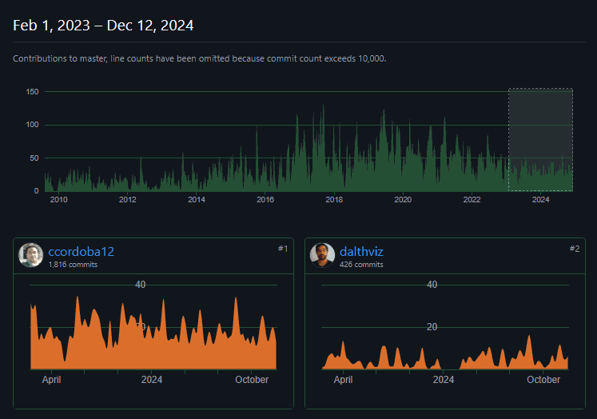
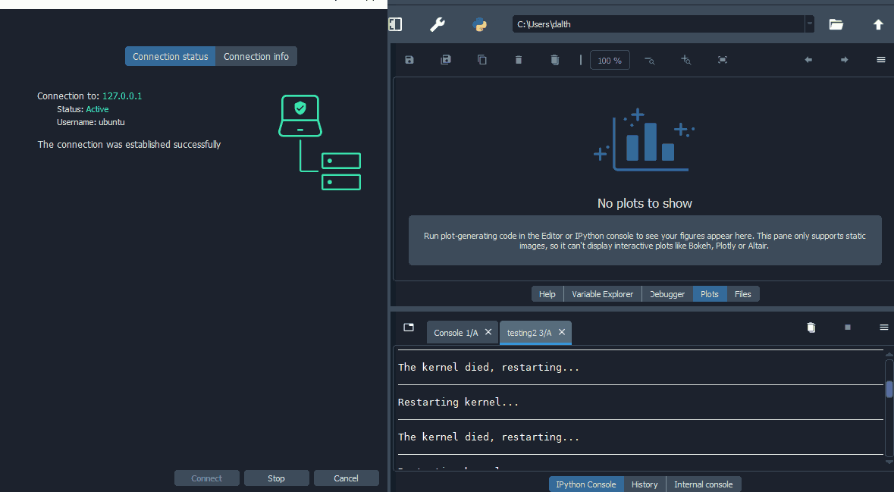
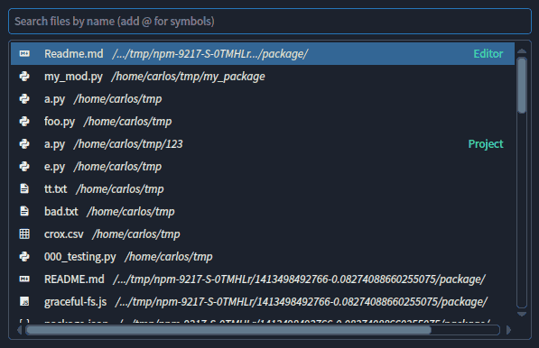
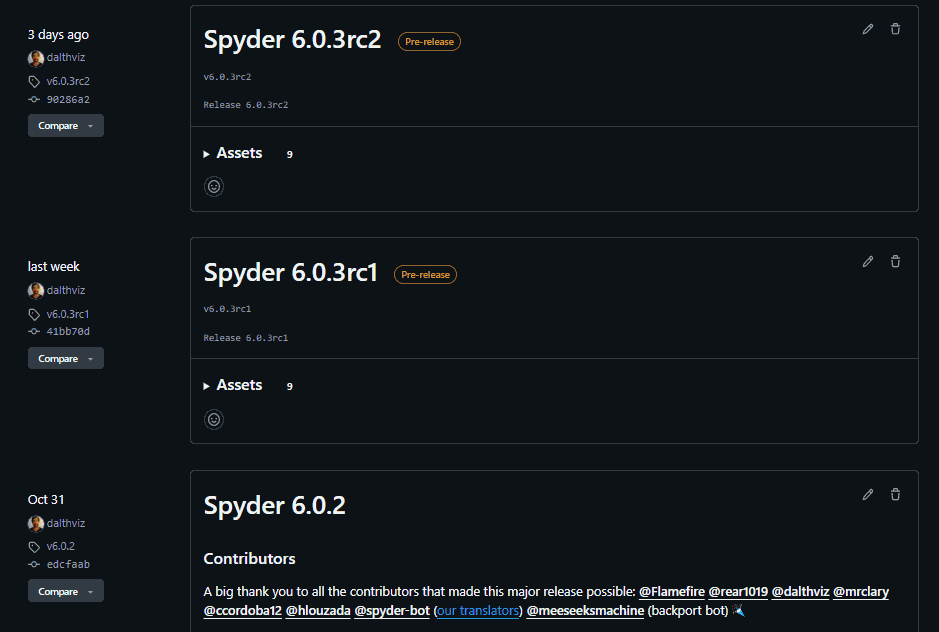

[Daniel Althviz](https://github.com/dalthviz) is one of our longest-tenured Spyder developers, having started working on the project near the end of 2016.
Now eight years later, he's the project's co-maintainer and its our release manager, responsible for the many steps required to release Spyder across all our various platforms.
On top of that, he is also the lead maintainer of two of the most important libraries on which Spyder, and a lot of other scientific software, depends: the [QtPy](https://github.com/spyder-ide/qtpy) GUI abstraction layer and the [QtAwesome](https://github.com/spyder-ide/qtawesome) icon font framework.

In 2023, Spyder received a [Chan Zuckerberg Initiative](https://chanzuckerberg.com/) Essential Open Source Software for Science Cycle 5 grant, [number 384](https://chanzuckerberg.com/eoss/proposals/enhancing-spyder-ide-remote-support-for-scientific-research-in-python/) to support a new remote development architecture and features in Spyder and related development.
This has helped us fund Daniel's work on many of his contributions to Spyder 6 connected to that!

Thanks to all his experience and responsibilities, Daniel has put in a lot of work toward Spyder 6's development.
Read on to hear the highlights!  

## Spyder Editor migration to new plugin API

We introduced a brand new plugin API with Spyder 5, and as part of that refactored most of Spyder's panes and many other of its internal components to be plugins that use it, rather than tightly coupled with Spyder itself.
That both makes Spyder much more modular and easier to maintain, and gives external plugins all the same power and flexibility that internal panes and components have!
However, the one major exception to that in Spyder 5 was the Editor, which hadn't been migrated due to the high level of complexity and the further new features that would need to be added to the plugin API.

Migrating the Editor to the modular API was the final piece of the puzzle to make Spyder a fully pluggable application, avoid having to maintain two duplicate APIs and enhance interoperability with other plugins, such as those being developed for remote development in Spyder 6.
Specifically, it was a prerequisite for implementing remote editing capabilities, which will arrive in Spyder 6.2.
Therefore, we prioritized finishing this migration for Spyder 6, with Daniel completing the work originally started by [Gonzalo Peña-Castellanos](https://github.com/goanpeca), [Edgar Margffoy](https://github.com/andfoy) and [Stephannie Jimenez](https://github.com/steff456).

Given the size of the task, Daniel split it into a number of steps, each corresponding to a GitHub Pull Request.
First, [he split](https://github.com/spyder-ide/spyder/pull/20893) the ``CodeEditor``, the main widget for editing code, into a component in charge of code completion and linting, and another one in charge of editing.
This helped separate those concerns and improve improve overall modularity and maintainability.
Then, [he refactored](https://github.com/spyder-ide/spyder/pull/21194) the ``EditorStack`` code, the widget in charge of displaying multiple tabbed ``CodeEditor`` views, to facilitate the migration.
Finally, he migrated the Editor itself to the new API in two steps: an [initial migration](https://github.com/spyder-ide/spyder/pull/21353), and a [followup cleanup](https://github.com/spyder-ide/spyder/pull/22005).
This last step alone took six months of hard work, but it will help to address a lot of technical debt accumulated throughout the years.

## Remote development architecture quality testing

Once the Editor migration was moving along, Daniel helped review, test and QA the new remote development architecture.
As part of that, he also developed a number of fixes and improvements to address the issues he found.
For instance, he implemented [several UI/UX improvements](https://github.com/spyder-ide/spyder/pull/22303) for the graphical components used to create a remote connection, based on the issues he found.

Furthermore, during his checks of remote connections working on Windows, he discovered several errors with running async code, which he helped [fix](https://github.com/spyder-ide/spyder/pull/22137).
Finally, he also encountered problems when trying to tunnel ports through SSH, which he also contributed to [solving](https://github.com/spyder-ide/spyder/pull/22223).
This all helped make our remote development architecture much more stable and usable.
To learn more about Spyder's new remote development architecture, check out [Hendrik's blog post!](../spyder-6-remote-development/).

## Spyder test suite overhaul

To enhance testing of Spyder 6 and its new components, Daniel helped make the Spyder test suite faster and more robust.
The core team was witnessing constant errors and delays when running automated tests in continuous integration systems, which made it necessary for Daniel invest several weeks to fix that so that the Spyder 6 development process was smoother.
Therefore, [Daniel's work](https://github.com/spyder-ide/spyder/pull/22077) improved this situation, as well as making the tests more efficient overall.

## Review work and project management

Much of Daniel's responsibilities involve reviewing, mentoring and assisting with the work of other developers, an important role in any project.
Daniel helped [Ryan Clary](https://github.com/mrclary), the developer who created our new [Conda-based installers](../cbi-installers) for Spyder 6, test and validate the installers and their update process for each release in the year-long process of stabilizing them, as well as finding and reporting many bugs on Windows.

Daniel also reviewed and assisted with [Angela Remolina](https://github.com/AngelaRemolina)'s work on major improvements to Spyder's File/Symbol Switcher.
Angela, an intern who worked on Spyder over several months, migrated the File/Symbol switcher to a plugin, so it is modular and accessible to other plugins.
As part of this project, she also added the initial support in the switcher for lightning-fast, [fzf](https://github.com/junegunn/fzf)-accelerated searching of all files in the current project.

Finally, Daniel performed an in-depth review of the numerous UI/UX enhancements for Spyder 6 developed by [Juan-Sebastian Bautista](https://github.com/jsbautista), whom Daniel has mentored and managed for the past two years.
This work has made Spyder much easier and more intuitive to use, including for users with accessibility needs.
Thanks to Daniel's mentorship, Juan-Sebastian looks to continue his work with Spyder into the future.

## Spyder release management

Since February 1, 2023, thanks to the CZI grant funding mentioned before, Daniel has also been active as Spyder's Release Manager, taking on the substantial task of handling the many critical steps required to produce stable packages for the many platforms we support, including:

* [PyPI](https://pypi.org/project/spyder/) (pip)
* [Conda-Forge](https://anaconda.org/conda-forge/spyder) (Conda)
* [Spyder installers](https://www.spyder-ide.org/download/), and the
* [GitHub releases](https://github.com/spyder-ide/spyder/releases).

Since then, he has served as Release Manager for one minor and eight bugfix releases for Spyder 5 (from 5.4.3 to 5.5.6), and eight pre-releases, one major release and three bugfix releases for Spyder 6 (from 6.0 alpha2 to 6.0.3).
Without his work, our users wouldn't have been able to benefit from all the developmental and stable releases that we've had, especially for Spyder 6!

## What's next?

In the immediate future, Daniel will continue his critical role as the Release Manager for Spyder, ensuring users keep seeing regular updates for Spyder 6.
Additionally, he'll further his partnership with Juan-Sebastian, this time focused on maintaining Spyder 6.0 and fixing any further bugs that are found.
He'll also work on improving [Jupyter QtConsole](https://qtconsole.readthedocs.io/en/stable/), the frontend that Spyder (in the IPython Console) and other users and applications employ to provide a rich, interactive graphical interface to local and remote kernels.
Finally, he'll help implement the frontend interface to remote file systems as part of our remote development work, allowing users to manipulate remote files and directories just like those locally!

We're looking forward to seeing the fruits of all that work, and as always, happy Spydering!🕸️
