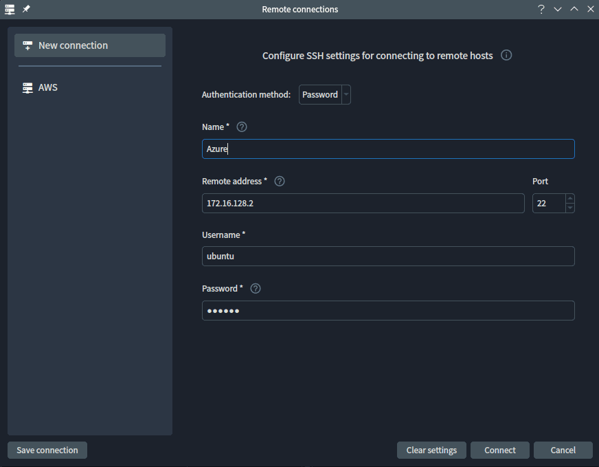
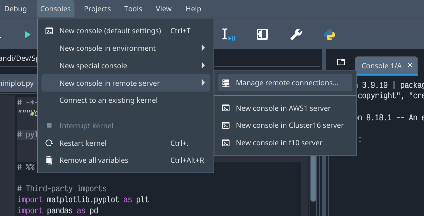
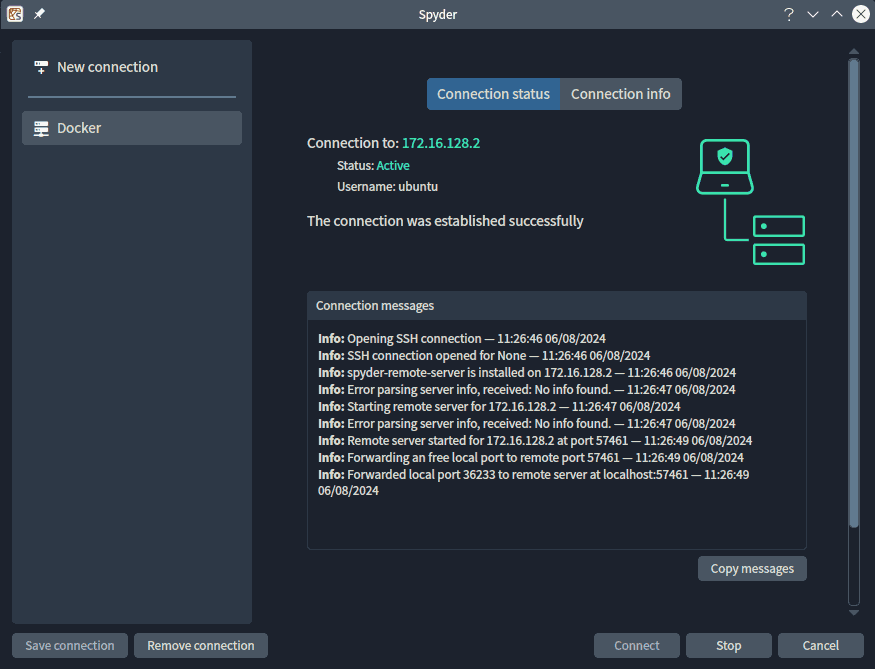

The foundations of Spyder's new remote development architecture are available now in Spyder 6.0, with more features to come in 6.1 and beyond!
The goal is to make it easy for you to host your files, data and computations on remote desktops, clusters, servers and the cloud while being able to use Spyder locally.

Spyder 6.0 features a new remote connection manager that allows you to connect to any machine with a SSH server, no prior installation or configuration needed, and automatically set up and use a remote Python environment  on the host.
It also features graphical status checking and reporting, host configuration management, and more.
In addition, it brings a new `Consoles` submenu allowing you to connect to any remote host and launch a console with one click.
You can also stop code execution as well as restart remote kernels from within Spyder.

<video controls>
  <source src="remote-console-demo.mp4" type="video/mp4">
</video>

We're excited to have our newest core developer, Hendrik Louzada, share with you his insights and perspectives on Spyder 6's new remote development architecture he helped implement!
Join us as Hendrik shares how he got started with Spyder and the project, how the new achetecture is implemented under the hood, what challenges he faced and what he learned from them, and what's next for Spyder 6.1.0!

## How'd you find out about Spyder and why'd you join the project?

I first started to work on Spyder around three years ago, developing a series of plugins to control remote magnetic resonance equipment (such as MRI machines) directly in the IDE.
As part of that project, I made several upstream contributions to Spyder itself to improve the Language Server Protocol support (LSP, the architecture that powers Spyder's code completion, introspection, analysis and formatting).

In 2023, Spyder received a [Chan Zuckerberg Initiative](https://chanzuckerberg.com/) Essential Open Source Software for Science [Cycle 5 grant](https://chanzuckerberg.com/eoss/proposals/enhancing-spyder-ide-remote-support-for-scientific-research-in-python/) to implement a new remote development architecture and features in Spyder to allow users to develop and run code in remote servers and cloud machines.
After a six-month search by Spyder lead maintainer Carlos Cordoba to find the right candidate to engineer the backend and network architecture for this project, he found me, so I joined the core development team near the end of 2023.  

## How is the new remote development platform implemented?

The backend, [`spyder-remote-services`](https://github.com/spyder-ide/spyder-remote-services), uses [Jupyter Server](https://jupyter-server.readthedocs.io/) and the [JupyterHub API](https://jupyterhub.readthedocs.io/en/stable/reference/rest-api.html), since Spyder already leverages the Jupyter architecture to manage kernels and run code.
We decided to use SSH to communicate with the remote machine, since it's secure and widely used for this purpose.

That project is managed through an internal Spyder plugin, *Remote Client*, which uses the Jupyter API to manage remote Spyder kernels and connect them to Spyder.
The *Remote Client* [frontend](https://github.com/spyder-ide/spyder/pull/22079) and [backend](https://github.com/spyder-ide/spyder/pull/21757) were developed as an interface for Spyder to connect and manage the Jupyter Server installed on the remote machine.
The plugin connects to the machine, installs the server, and creates SSH tunnels for the exposed server and extra APIs implemented by `spyder-remote-services`.
Once that's complete, Spyder will be able to automatically create remote [IPython Consoles](https://docs.spyder-ide.org/current/panes/ipythonconsole.html) on behalf of users.
Furthermore, you can now stop remote computations and restart remote kernels, which was not possible before.  

## What challenges did you face and how'd you overcome them?

There are a number of Python libraries that implement the SSH protocol, but most of them use the underlying SSH client and server installed by the operating system.
Unfortunately, the Windows SSH client has a serious issue that prevents tunnels from working correctly, so I needed to find an implementation that uses the underlying SSH libraries directly instead.
After investigating a number of options, the [AsyncSSH project](https://github.com/ronf/asyncssh) was the only one that both meets that requirement and is also robust and well maintained.
Hence, I implemented tunneling using that library in the pull request [spyder-ide/spyder#22223](https://github.com/spyder-ide/spyder/pull/22223).

However, there was still an important problem with AsyncSSH: Spyder uses the Qt framework's event loop for its graphical user interface, which is not async-enabled.
Therefore, I had to write an async API that was flexible enough to be able to call several async functions in a specific event loop, allow for loops to be run concurrently (to avoid blocking the main Qt event loop and causing Spyder's GUI to freeze), and be thread-safe so it can be called from any Qt thread.

To cover all those requirements, I created the [`@AsyncDispatcher` decorator](https://github.com/spyder-ide/spyder/blob/v6.0.0/spyder/api/asyncdispatcher.py#L39) function, which starts a thread to run an async loop if needed, schedules the async function in a specific loop, and returns a future object with the async function's result.
That result is emitted in a Qt signal which is then used by Spyder synchronously to perform other tasks (e.g. check if the server is running).  

## What have you learned so far?

Working on an open source project has provided me with the opportunity to witness how my contributions directly impact users in real time.
Seeing my work being utilized and appreciated by the Spyder community is very rewarding and motivates me to strive for excellence and dedication.
Additionally, observing individuals dedicated to improving Spyder for many years with a common goal to help the scientific community, and without focusing primarily on profit, is incredibly inspiring.

This project has taught me the importance of adaptability and perseverance.
There were moments with problems too hard to understand by myself, but with the team's support I was able to push through those obstacles, making me more confident and resilient.

I'm very grateful for the opportunity to work on Spyder with such a dedicated and supportive team.
I am excited to apply the lessons learned as we move into the next phases of this project!

## What's next for the project?

Our plans for the next feature version, [Spyder 6.1.0](https://github.com/spyder-ide/spyder/milestone/134), include adding the necessary APIs to `spyder-remote-services` so it can manipulate the remote file system.
This will allow you to view, copy, move and delete remote files and directories right from Spyder's Files pane.
Users will also be able to create and manage local and remote Python environments, so they can work in different scientific and programming projects remotely at the same time.

Finally, we plan to enable connecting to an already running JupyterHub instance, for situations where the user's organization already has one set up that they want to work with using Spyder.
The changes required will be relatively straightforward since instead of talking to our own server for remote development, users will communicate with the existing JupyterHub instead.

We can't wait to bring these features to you in our next feature version, coming in the first half of next year, and see all the cool things you all end up doing with them.
And until then, as always—Happy Spydering!🕸️
